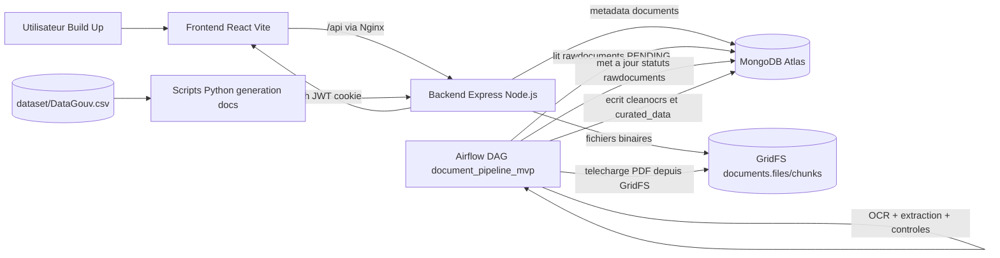
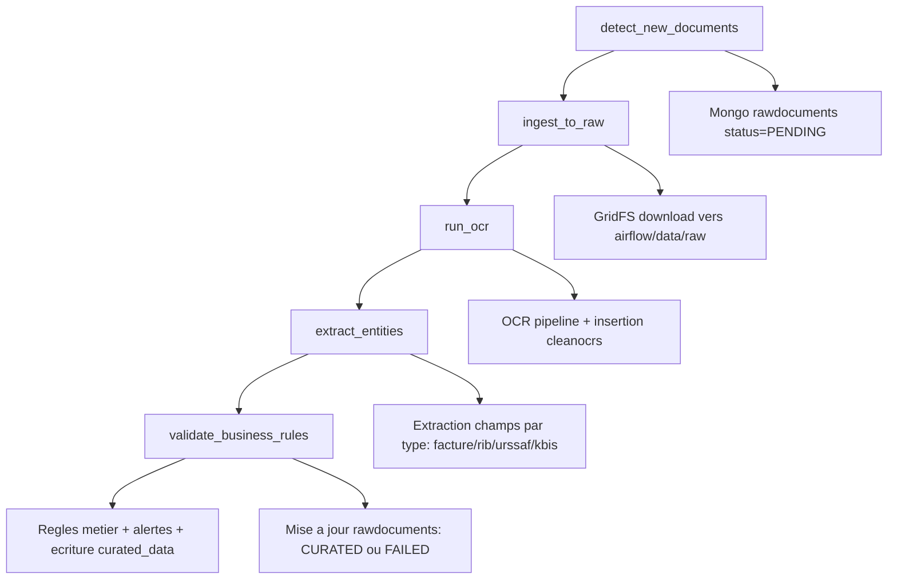

# Build Up - Plateforme de gestion de fichiers administratifs

Application MVP de gestion documentaire pour la societe Build Up.
Le projet permet de:
- uploader des documents administratifs,
- stocker les fichiers binaires dans MongoDB (GridFS),
- lancer un pipeline OCR + extraction + controles metier via Airflow,
- produire des donnees "curated" exploitables pour la conformite et le suivi.

## 1) Objectif produit

Build Up centralise les documents fournisseurs (KBIS, RIB, URSSAF, factures, devis) afin de:
- reduire le traitement manuel,
- fiabiliser les controles administratifs,
- detecter les cas bloquants (ex: URSSAF expiree, incoherence facture),
- preparer les donnees pour un suivi metier.

## 2) Vue d'ensemble technique

Le projet est compose de 3 blocs:
- Frontend React (auth + pages utilisateur),
- Backend Node.js/Express (API, auth, upload, GridFS),
- Orchestration Airflow (OCR, extraction d'entites, validation metier).

### Architecture globale



## 3) Parcours fonctionnel

1. Un utilisateur se connecte sur le frontend.
2. Un document est envoye au backend (endpoint upload).
3. Le backend:
   - stocke le binaire dans GridFS,
   - cree un enregistrement metier dans `rawdocuments` avec statut `PENDING`.
4. Le DAG Airflow `document_pipeline_mvp` est declenche.
5. Le DAG:
   - detecte les documents `PENDING`,
   - les recopie en local (`airflow/data/raw`),
   - lance l'OCR,
   - extrait les champs selon le type de document,
   - applique les regles metier,
   - met a jour les collections MongoDB (`cleanocrs`, `curated_data`) et les statuts.
6. Le backend expose ensuite les donnees et operations de consultation/suppression.

## 4) Detail du pipeline Airflow

Le DAG principal est dans [airflow/dags/document_pipeline_mvp.py](airflow/dags/document_pipeline_mvp.py).

### Flux DAG (Mermaid)



### Regles metier clefs (MVP)

- KBIS:
  - controle SIREN,
  - gestion d'obsolescence (> 90 jours),
  - versionning de la fiche active.
- RIB:
  - verification presence IBAN,
  - controle de coherence avec un KBIS valide.
- URSSAF:
  - controle date d'expiration,
  - marquage bloquant si attestation expiree.
- Facture:
  - verification coherence HT/TVA/TTC,
  - verification existence d'un fournisseur valide (via KBIS).

## 5) Structure de dossier (resume)

- [client](client): frontend React + TypeScript
- [back](back): API Express + MongoDB + GridFS
- [airflow](airflow): stack Airflow + DAG OCR
- [script](script): scripts Python de generation de documents de test
- [dataset](dataset): donnees source (ex: DataGouv)
- [docker-compose.yml](docker-compose.yml): stack Docker backend + frontend

## 6) Demarrage rapide

## Docker (frontend + backend)

Depuis la racine:

```bash
docker compose up --build -d
```

Acces:
- Frontend: http://localhost:5173
- Backend: http://localhost:8080

Pour arreter:

```bash
docker compose down
```

## Docker Airflow (pipeline OCR)

Depuis [airflow](airflow):

```bash
docker compose up airflow-init
docker compose up -d
```

Acces:
- Airflow UI: http://localhost:8081
- login: `admin`
- password: `admin`

Arret:

```bash
docker compose down
```


## 7) API principale (backend)

### Auth utilisateur

- `POST /user/register`
- `POST /user/login`
- `POST /user/forgot-password`
- `POST /user/reset-password`
- `POST /user/logout`
- `GET /user/me` (auth requis)
- `GET /user/getCuratedData` (auth requis)

### Documents

- `POST /document/upload`
- `GET /document/info/:docId`
- `GET /document/infoOCR/:docId`
- `GET /document/download/:gridFsId`
- `DELETE /document/delete/:docId`
- `GET /document/generate/:docType`

### Administration utilisateurs (role admin requis)

- `GET /user-manager`
- `GET /user-manager/:id`
- `PATCH /user-manager/:id/role`
- `DELETE /user-manager/:id`
- `POST /user-manager/seed`

## 8) Etat actuel du MVP

- Le pipeline OCR/validation est actif cote Airflow.
- Le backend gere bien upload/download/suppression et stockage GridFS.
- Le frontend contient les parcours auth et upload.
- Le composant upload frontend est actuellement simule (delai local) et n'envoie pas encore les fichiers a l'endpoint backend.

## 9) Prochaines evolutions recommandees

1. Connecter [client/src/components/uploadFiles/UploadFile.tsx](client/src/components/uploadFiles/UploadFile.tsx) a `POST /document/upload`.
2. Ajouter un proxy Vite pour `/api` en developpement.
3. Ajouter des tests end-to-end (auth + upload + execution DAG).
4. Renforcer la securite: rotation des secrets, gestion centralisee des variables d'environnement, hardening cookies/CORS selon environnement.
